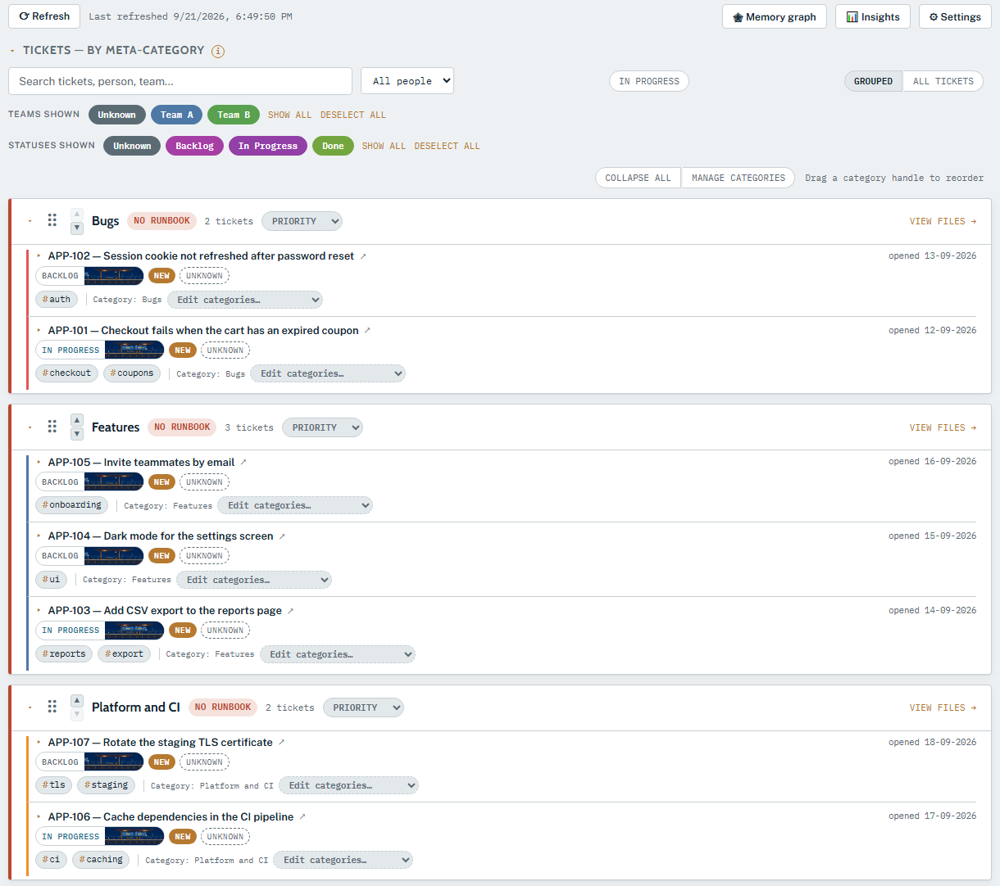

<p align="center">
  
</p>

# Ticket Terminal

*Your ticket board, wired directly into the coding agents doing the work.*

Ticket Terminal is a local ticket board where every ticket has a **real embedded terminal** — an
actual `claude` or `codex` session, scoped to that ticket, that can pick up the work, run real
commands, and leave a permanent transcript behind. It's built for any engineering role, not one —
backend, frontend, mobile, QA, data, devops — categories, knowledge docs, and starter presets are
all role-configurable, not hardcoded to a single discipline.

<p align="center">
  
  <br><sub>The board, with sample data. Each ticket opens its own Claude or Codex terminal.</sub>
</p>

Underneath the board sits a **shared, vendor-neutral memory**: a knowledge base of architecture
notes, runbooks, and decisions that any agent — Claude, Codex, or a future local model — can read
and write, with an editable diagram view so it's never just a wall of prose. A team's institutional
knowledge and an agent's working memory become the same artifact, instead of living in someone's
head, a wiki no one reads, or a chat transcript no one else can see.

- **Real embedded terminals** — Claude and Codex sessions per ticket, resumable, cost-tracked, with a permanent transcript.
- **Vendor-neutral memory** — a markdown + Mermaid knowledge graph any LLM can read and write; not tied to one vendor.
- **Jira sync** (Notion in progress) — meets your team where its tickets already live.
- **Role-aware categories** — ten engineering-role starter presets, fully custom past that.
- **Local-first** — runs on your machine against your own credentials; never a hosted black box.

Tickets are assigned to meta-category lanes that double as a knowledge index (each lane links out
to its team's runbooks/skills/memory docs), with an editable priority, a person→team map,
epic/parent-ticket grouping, and a search/filter layer — plus, per ticket: an activity-log/notes
history and a GitLab MR link field.

## Why a real local app, not a hosted page

A sandboxed web page can never spawn a local process — no `terraform`/`aws`/`git` against a
ticket, no permanent transcript of the AI session that did it. This is a real app with a real
backend, running entirely on your own machine, specifically so the embedded terminal can do that.

## Running it

```bash
python3 -m venv .venv && source .venv/bin/activate
pip install -r requirements.txt
python server/main.py
```

Then open **http://127.0.0.1:4173**. That's it — no build step, no separate frontend process.

**Security note, deliberate not accidental:** the server binds to `127.0.0.1` only. It can spawn a
real shell (that's the whole point of the embedded terminal), so it must never be reachable from
the network. There's no login/auth layer on top of that — localhost-only *is* the security
boundary for v1.

## Layout

- `server/main.py` — FastAPI app. Serves `public/` as static files, a REST API for
  tickets/people/team-options, and `WS /ws/terminal/{key}` — a real PTY running `claude`,
  bridged to the browser.
- `server/db.py` — the datastore: a single JSON file (`data/workspaces/<slug>/db.json`), no ORM,
  no SQLite. The data is a few hundred documents; a real database would be unjustified complexity
  here.
- `server/workspaces.py` — the workspace registry and the ContextVar that decides which
  workspace a given request, WebSocket or background sync is reading (see "Workspaces" below).
- `server/jira_sync.py` — the server's own live read of Jira status/priority (see "Jira sync"
  below). Needs `.env`; a no-op without it.
- `server/notion_sync.py` — the same for a Notion database as a second ticket source, with the
  OAuth handshake against your own Notion integration (see "Notion sync" below). A no-op until
  connected from the Settings page.
- `server/cost_analysis.py` — per-ticket cost via the real `codeburn` CLI (see "Cost analysis"
  below). Needs `codeburn` on `PATH`; the cost badge is just absent without it.
- `server/content.py` — reads your board's lane/category definitions and their linked
  runbook/knowledge docs (see "Configuring your categories and knowledge base" below).
- `public/index.html` / `board.js` / `terminal.js` — the frontend. Plain vanilla JS, no build
  step, no bundler — `fetch()` calls against the REST API above.

## Workspaces

One install can hold several named workspaces — a work board and a side project, say. They are
**switched between, never merged**: there is deliberately no combined board, no "all my tickets"
and no cross-workspace sprint selector anywhere. Each workspace owns its tracker connection, its
tickets, its categories and knowledge docs, its terminal transcripts and its memory folder
(`memoryDir` lives in that workspace's `settings.json`, so it follows for free).

If you only have one workspace you will never see any of this: no picker, no workspace chrome,
the board exactly as it was.

The workspace is part of the route — `#/w/<slug>`, `#/w/<slug>/category/<id>`,
`#/w/<slug>/settings`, `#/w/<slug>/memory` — so a pasted link carries it and the back button
works, and every API call carries `?w=<slug>`. A bare `#/…` (and `?w=` omitted) means the default
workspace, so every pre-workspaces link still works. The literal slug `default` also resolves to
whatever this install's default workspace is actually called.

Syncing follows from that: the 10-minute background timer syncs the **default** workspace and
nothing else. Any other workspace syncs when you switch to it, and only if nothing has synced it
within `TRACKER_SYNC_INTERVAL_SECONDS` — otherwise flipping back and forth would restart a sync
that takes an hour on a large board. That sync never blocks: the stored board renders
immediately and the refresh lands when it lands. Sync locks are per-workspace, so a long sync in
one never holds up a short one in another, and a terminal session in one workspace stays alive
while you work in another.

New workspaces are created from the Settings page ("New workspace…" in the picker). A slug is
lowercase letters, digits and hyphens; `default` is reserved.

### Migration from the old flat layout

The first start after upgrading moves an existing `data/db.json`, `settings.json`,
`categories.json`, `docs.json`, `category-management.json` and `sessions/` into
`data/workspaces/default/` and writes `data/workspaces.json`. Files are **moved**, never
re-synced — a large board would take an hour to re-import. It runs once, is idempotent, and does
nothing at all on a fresh install.

To rename that default workspace afterwards: stop the server, `mv data/workspaces/default
data/workspaces/<slug>`, and set `"defaultWorkspace": "<slug>"` in `data/workspaces.json`.

## `data/` is live state, not source — and most of it is gitignored

```
data/
  workspaces.json            # the registry: defaultWorkspace + one entry per workspace
  categories.example.json    # shipped examples stay at the data root, shared by every workspace
  docs.example.json
  workspaces/
    default/                 # everything that is one board's state
      db.json  settings.json  categories.json  docs.json  category-management.json  sessions/
```

`db.json` (tickets/people/team-options), `categories.json` / `docs.json` (your board's lanes and
knowledge-base content), and `sessions/` (saved terminal transcripts, one file per ticket,
referenced from that ticket's activity log) are **not committed** — same reasoning as never
committing a real database to git. **You are responsible for backing this up** if you care about
it. Each of `categories.json`/`docs.json` has a committed `*.example.json` sibling at the data
root with a couple of placeholder entries, so a fresh clone — or a brand-new empty workspace —
renders a working (if empty) board immediately; the app falls back to those whenever the real
file is missing.

`.env` stays global: it is the scriptable bootstrap fallback for any workspace, and a value saved
on a workspace's Settings page always wins over it.

## Configuring your categories and knowledge base

Copy the shape from `data/categories.example.json` into your workspace's `categories.json`
(`data/workspaces/<slug>/categories.json`): an array of
`{id, name, status, color, note, memories, skills, docs}` lane definitions — `status` is one of
`covered`/`partial`/`gap`, `docs` lists ids that must each have a matching entry in
that workspace's `docs.json` (shape: `data/docs.example.json` — `{title, path, kind, content}`
per id, `kind`
one of `skill`/`claude`/`memory`). These render as the board's lanes and their linked runbook
detail pages; there's no server-side validation beyond "does this id exist," so start from the
example files and extend them.

## Jira sync

The server has its own live read of Jira — no Claude Code session required for this part.
`server/jira_sync.py` refreshes the title, status, priority, and content tags for every ticket
already on the board, two ways:

- **On a timer**: every 10 minutes in the background, regardless of whether a browser tab is open.
- **On click**: the board's "Refresh" button triggers an immediate sync, then reloads.

This needs a `.env` (gitignored, never committed) with your own Jira API token:

```bash
cp .env.example .env
# then fill in JIRA_BASE_URL, JIRA_EMAIL, JIRA_PROJECT_KEY, and a token from
# https://id.atlassian.com/manage-profile/security/api-tokens
```

Without a `.env`, sync is simply unavailable (refresh still reloads local data, it just skips the
Jira round-trip) — nothing else about the app depends on it. `JIRA_PROJECT_KEY` scopes which
tickets get pulled in; `WMP_DEFAULT_WORKDIR` (also in `.env.example`) is where a ticket's embedded
terminal runs `claude` when that ticket has no `workDir` of its own — defaults to your home
directory. `board.js`'s `JIRA_PRIORITY_ORDER`/`JIRA_PRIORITY_COLOR` default to Jira's stock
Highest/High/Medium/Low/Lowest scheme; edit that array if your project uses different priority
values.

New Jira tickets created after the newest tracked ticket are also imported. Their category is a
best-effort suggestion and remains marked for human review. Existing category assignments,
team, notes, sessions, and MR links stay untouched by refresh.

Each refresh generates one to three content tags from the Jira title and description using the
signed-in Claude CLI (`haiku`, tools disabled, no session persistence). These tags describe the
actual subject, such as `kubernetes`, `certificate rotation`, or `query performance`; categories
continue to control board placement. A source hash avoids sending unchanged tickets to the model
and regenerates tags when the category list changes so category names stay excluded.
If generation fails, Jira fields still refresh, existing tags remain in place, and the next refresh
retries. Set `WMP_CLAUDE_BIN` when `claude` is not on the server's PATH.

## Notion sync

Notion works as a second ticket source next to (or instead of) Jira: one Notion **database** is
the project, each page in it is a ticket. Both trackers refresh on the same 10-minute timer and
the same Refresh button; a ticket's `source` field says which one it mirrors, and editing its
status or priority on the board pushes back to that tracker.

**Connecting with a personal token** (the recommended path, about a minute):

1. At [notion.so/my-integrations](https://www.notion.so/my-integrations) create an integration for
   your workspace and leave it **Internal** — nobody outside the workspace can see or use it. Copy
   its Internal Integration Secret (`ntn_…`).
2. In Notion, open your tickets database → `···` → **Connections** → add that integration, so it can
   read the pages.
3. In the board, **Settings → Notion connection**: paste the secret, click **Connect with token**.
   The token is checked against Notion before it's stored, so a bad paste never replaces a working
   connection.
4. Pick the database from the dropdown (only databases shared with the integration appear), check
   the detected status/priority columns, Save, then **Sync now**.

`NOTION_TOKEN` / `NOTION_DATABASE_ID` in `.env` do the same for scripted setups; the Settings page
overrides them.

**Advanced: OAuth with a public integration.** Only worth it if you hand this board to people in
other workspaces, since it lets them authorize through a Notion login screen with nothing to paste.
It requires switching the integration to **Public** in Notion (company name, website, privacy
policy) — it isn't listed anywhere, but anyone holding the client ID can authorize it into their own
workspace. Copy the client ID and secret into the "Advanced: OAuth" fold of the Notion settings,
add `http://localhost:4173/api/notion/oauth/callback` to the integration's redirect URIs (it must
match the Redirect URI field exactly; change both if you run on another host/port), Save, then
**Connect with Notion**. The server hosts both legs of the handshake (`GET /api/notion/oauth/start`
redirects to Notion's consent screen; `GET /api/notion/oauth/callback` validates a single-use CSRF
`state`, exchanges the code, and stores the token in that workspace's gitignored `settings.json`). Refresh
tokens are used automatically when Notion issues them; if a token is ever rejected without one,
Settings shows the error and **Reconnect** fixes it.

**How a page becomes a ticket:** the title column is the summary; a `unique_id` column (Notion's
"ID" property, e.g. `PROJ-42`) is the ticket key when present, otherwise `NOTION-<8 chars of the
page id>`; the status column (type *status* or *select*, auto-detected by name, overridable) fills
the board's status; an optional priority column fills priority, with its own option list rather
than Jira's Highest…Lowest scheme; the page body's top-level blocks become the description.
Unlike Jira discovery, the first Notion sync imports the **whole** database (picking the database
is the scoping decision) — every new page gets the same LLM category suggestion, NEW marker, and
content tags as a Jira ticket. Category, team, notes, sessions and MR links stay human-owned.

**Sprints.** Teams model sprints in every imaginable way, so the board looks for the *shape* of one
rather than a column called "Sprint": a relation pointing at a small database of named, dated rows
that many tickets link to. Where two relations look alike — a live "Sprint" and an archival
"Previous Sprints" — the one actually filled in on recent tickets wins. Every sprint found is
reduced to the same few facts the board sorts and filters on: a name, a start and end date, and a
state of **active**, **future** or **closed**.

Notion has no such state, so it is worked out: a date range covering today means active, an ended
one closed, one not yet started future. That leaves the gap days, when yesterday's sprint has
finished and tomorrow's has not begun and the dates say nothing. For those the board learns your
workspace's **active sprint marker** — the status value that means "running", say `Current` — by
seeing which value the sprint covering today carries. It is stored in that workspace's `settings.json` and
re-checked on every sync, and Settings shows where it came from; if the guess is wrong (or there is
nothing to guess from), pick the right value there and **Confirm**, and inference stops second-
guessing you. A blank confirmation hands the question back to inference.

The API version is pinned to `2022-06-28` so databases are queried directly; if Notion retires that
version this adapter's query endpoint is the one thing to update.

## Cost analysis

As of 2026-09-06, every ticket that has ever opened a real embedded Claude session shows a `$`
badge (hover it for call count + model). This shells out to the real
[codeburn](https://github.com/getagentseal/codeburn) CLI rather than reimplementing its pricing —
codeburn already parses `~/.claude/projects/**/*.jsonl` (the same transcripts this server reads for
session-resume checks) with its own maintained Anthropic pricing/model-alias/tiered-cost logic,
which is substantial enough that hand-porting it would be a maintenance trap. `server/cost_analysis.py`
just runs `codeburn sessions --format json` and keys the result by session id.

Needs Node.js ≥22.13 and a global install:

```bash
brew install node      # or nvm/your Node install of choice
npm install -g codeburn
```

Without `codeburn` on `PATH`, the cost badge is simply absent (the server logs the missing-binary
error) — nothing else about the app depends on it.

## Codex terminals

Expand a ticket and choose **Open Claude** or **Open Codex**. Each provider has its own
terminal, resumable conversation, stop control, and cost badge. Opening the details panel
alone no longer starts an agent. Collapsing a terminal keeps its process alive; use Stop
Claude / Stop Codex to end it. Reopening reconnects or resumes the stored session.

Install and sign in to the Codex CLI (`codex login`) on the same machine as the server.
The server needs `codex` on PATH. It uses your existing Codex configuration and authentication;
no API key needs to be entered into Ticket Terminal. See the
[official CLI documentation](https://learn.chatgpt.com/docs/codex/cli).

Codex generates its own session UUID. Ticket Terminal records a unique opening-prompt marker
and resolves it against the read-only local Codex session index (with legacy rollout fallback).
It never uses the latest session in a shared working directory. The resulting `codexSessionId`
is stored separately from `claudeSessionId`. This index adapter may need updating if a future
Codex version changes its local storage schema. `CODEX_HOME` is honored when configured.

Both providers use `codeburn sessions --period lifetime --format json --provider all`.
Badges appear after codeburn reports usage and refresh every 15 seconds while terminals are
open. Figures are token-based cost estimates, not subscription invoices. Unavailable usage is
not displayed as a fabricated zero. Claude memory-file statistics remain Claude-specific.
Raw Codex terminal logs are saved separately in
`data/workspaces/<slug>/sessions/<ticket>.codex.log`.

Backend checks: `.venv/bin/python -m unittest discover -s tests`.

Codex executable lookup also checks standard macOS ChatGPT/Codex app installations and
common CLI installation paths. Set `WMP_CODEX_BIN` to an absolute executable path for a
custom installation (or `WMP_CLAUDE_BIN` for Claude); explicit overrides take precedence.

## Role-based categories and category review

New boards ask for a work role and preview a starter set. Existing boards keep their categories;
use **Manage categories** to save a role or explicitly apply a starter set. Ten engineering-role
presets are included, plus a custom-role input (uses the general engineering starter set).
The category editor supports add, rename, delete and reorder. Existing IDs stay fixed when
renaming so ticket assignments and knowledge links continue to work.

**AI category review** scans ticket titles, current category assignments, and the saved role using the
signed-in Claude CLI (`haiku`, tools disabled, no session persistence). Descriptions, notes,
credentials and knowledge files are not part of the scan prompt. Review suggestions to add,
rename, merge, or reassign ticket categories. Each includes a reason and affected-ticket preview;
select suggestions to accept or reject. No suggestion applies automatically. Scans that become
stale after tickets or categories change must be rerun. A merge preserves linked docs, skills,
and memory references. Independent suggestions can be accepted separately; conflicting batches
are rejected without applying partial changes.

Scans run on demand by default. Choose **Daily** or **Weekly** to enable background reviews
while the server is running. They pause while any suggestions await review. Scans consume model
tokens and require Claude CLI authentication. Errors are visible in the review panel; there is
no fallback that silently changes categories. On-demand scans can be run again after errors.

Every manual edit, starter-set application, accepted suggestion batch, and restore saves the
previous category definitions and ticket assignments in that workspace's gitignored
`category-management.json`.
Restore any version in **Category history**; the replaced version is saved too. Ticket notes,
status, sessions and other fields remain current. New tickets survive a restore; category assignments
that no longer exist become uncategorized. Keep backups of this file alongside its workspace's `db.json`
and its `categories.json`. A write-ahead record recovers an interrupted category/tag update.

The grouped view supports dragging the category handles, keyboard-accessible up/down buttons,
and **Collapse all / Expand all**. Order and collapsed state are saved per browser. Reordering
moves existing lane nodes to preserve embedded terminals. Applying structural category changes
requires detaching open terminal views (reload the page); background sessions remain available.
Each category and the **All tickets** view can sort by status, priority, or open date. Status sort
puts approval-waiting tickets first, followed by in-progress, selected, and backlog tickets.

Validation:

```bash
.venv/bin/python -m unittest discover -s tests
npm --prefix tests/ui ci
npm --prefix tests/ui test
```

The backend suite includes an isolated local HTTP server and mocked LLM responses; it does not
edit live categories or send real ticket data to a model. The UI suite checks the rendered DOM,
review decisions, lane ordering, expand/collapse and preservation of terminal elements.

## Contributing

Issues and PRs are welcome. Open an issue for anything you're about to spend real time on so it
isn't duplicated or built against a direction that's about to change, otherwise just send the PR.

Contributions use the [Developer Certificate of Origin](https://developercertificate.org/) —
sign off your commits with `git commit -s`. There's no CLA and no copyright assignment. See
[CONTRIBUTING.md](CONTRIBUTING.md).

## License

Apache 2.0 — see [LICENSE](LICENSE). Contributions are accepted under the same license.
