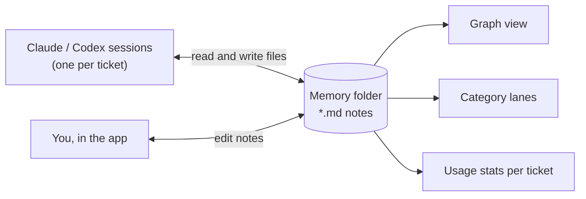

<p align="center">
  
</p>

# Ticket Terminal

*Your ticket board, wired directly into the coding agents doing the work.*

Ticket Terminal is a local ticket board where every ticket has a **real embedded terminal**: an
actual `claude` or `codex` session, scoped to that ticket, that can pick up the work, run real
commands, and leave a permanent transcript behind. Underneath the board sits a **shared memory**
that you and your agents both read and write.

<p align="center">
  
  <br><sub>Sample tickets and an illustrative session. Each ticket opens its own Claude or Codex terminal, with the cost badge coming from <code>codeburn</code>.</sub>
</p>

- **Embedded terminals**: Claude and Codex sessions per ticket, resumable, with a permanent transcript.
- **Shared memory**: a folder of markdown notes (with optional Mermaid diagrams) that any agent can read and write. See [Memory](#memory).
- **Cost per ticket**: a `$` badge on every ticket that has run an agent, via [codeburn](https://github.com/getagentseal/codeburn).
- **Jira and Notion sync**: tickets stay where your team already keeps them.
- **Role-aware categories**: lanes that double as an index into your runbooks and memory, with starter presets for ten engineering roles.
- **Local-first**: runs on your machine with your own credentials. No hosted service.

## Memory

Agents forget everything between sessions, and a team's knowledge usually lives in someone's head, a
wiki nobody reads, or a chat transcript nobody else can see. Ticket Terminal makes the knowledge
base a plain folder of markdown that humans and agents share:



**What a memory is.** One `.md` file per note, with optional frontmatter (`name`, `description`,
`type`), `[[other-note]]` links that become edges in the graph, and an optional ` ```mermaid `
block that renders as a diagram. There is no database and no proprietary format, so it diffs in git
and renders on GitHub or in Obsidian. The full spec is [MEMORY_FORMAT.md](MEMORY_FORMAT.md).

**Where it lives.** By default it is Claude Code's own per-project memory folder for your default
working directory (`~/.claude/projects/<cwd>/memory/`), so Claude sessions started there already
read and write it through Claude Code's built-in memory. To use a different folder, set it in
**Settings → Memory source** or with `WMP_MEMORY_DIR`. Codex, or any other agent with filesystem
access, can use the same folder; point it there from its own instructions file (for example
`AGENTS.md`).

**What the app does with it:**

- **Graph view** (`#/memory`): notes as nodes, links as edges, filterable by type. Click a note to
  read or edit it; edits are written straight back to the file. The app edits existing notes;
  agents (or you, on disk) create them.
- **Diagrams**: draft a Mermaid diagram for a single note, or one overview diagram for a whole
  category, using your signed-in `claude` CLI. The diagram is stored in the note itself.
- **Category lanes**: each lane lists the notes it relies on, shown with its runbooks and skills.
- **Usage tracking**: each ticket shows which notes its session actually read (exact `Read` calls
  for Claude, path mentions for Codex). The Insights page flags notes that are both large and
  heavily read, since those cost input tokens on every session that touches them.

## Quick start

Requirements: Python 3.12, and the [`claude`](https://docs.claude.com/en/docs/claude-code) and/or
[`codex`](https://learn.chatgpt.com/docs/codex/cli) CLI, signed in. Optional: Node.js 22.13+ for
cost badges, and a Jira or Notion account for ticket sync.

```bash
python3 -m venv .venv && source .venv/bin/activate
pip install -r requirements.txt
python server/main.py
```

Open **http://127.0.0.1:4173**. There is no build step and no separate frontend process.

To show cost badges, install codeburn once:

```bash
npm install -g codeburn
```

**Security:** the server binds to `127.0.0.1` only. It can spawn a real shell, which is the point of
the embedded terminal, so it must never be reachable from the network. There is no login layer;
localhost is the security boundary.

**Why a local app and not a hosted page?** A sandboxed web page cannot spawn a local process: no
`terraform`, `aws` or `git` against a ticket, and no transcript of the session that did it.

## Terminals

Expand a ticket and choose **Open Claude** or **Open Codex**. Each provider has its own terminal,
resumable conversation, stop control and cost badge. Collapsing a terminal keeps its process
alive; **Stop** ends it, and reopening reconnects to or resumes the stored session. Opening the
details panel does not start an agent.

- A ticket's terminal runs in its own `workDir`, or in `WMP_DEFAULT_WORKDIR` (default: your home
  directory).
- If `claude` or `codex` is not on the server's `PATH`, set `WMP_CLAUDE_BIN` or `WMP_CODEX_BIN` to an
  absolute path. Codex honors `CODEX_HOME`.
- Codex assigns its own session id. The app tags the opening prompt with a unique marker and looks
  it up in Codex's local session index, so it never resumes some other session in a shared directory.
- Transcripts are saved per ticket under `data/workspaces/<slug>/sessions/`.

### Cost badges

Every ticket that has run an agent shows a `$` badge (hover for call count and model). The app runs
`codeburn sessions --period lifetime --format json --provider all` and matches results to tickets
by session id, refreshing every 15 seconds while terminals are open. Figures are token-based
estimates, not subscription invoices, and unavailable usage is left blank rather than shown as
zero. Without `codeburn` on `PATH` the badge is simply absent.

## Categories and knowledge base

Tickets are grouped into **category lanes**. Each lane can link out to its team's runbooks, skills
and [memory](#memory) notes. New boards ask for a work role and preview one of ten engineering
starter sets (or a custom role); **Manage categories** lets you add, rename, delete and reorder
lanes. IDs stay fixed when you rename, so ticket assignments and links keep working.

To define lanes by hand, copy the shape from `data/categories.example.json` into your workspace's
`categories.json`: an array of `{id, name, status, color, note, memories, skills, docs}`. `status` is
`covered`, `partial` or `gap`, and each id in `docs` needs a matching entry in `docs.json` (shape:
`data/docs.example.json`, with `kind` one of `skill`, `claude` or `memory`).

**AI category review** looks at ticket titles, current categories and your saved role, using the
signed-in `claude` CLI (`haiku`, tools disabled). It suggests adds, renames, merges and
reassignments, each with a reason and a preview of the affected tickets. Nothing applies without
your approval, and descriptions, notes, credentials and knowledge files are never sent. Run it on
demand, or set it to daily or weekly.

Every category edit, accepted suggestion and restore saves the previous state, so you can roll back
from **Category history**. Ticket notes, status and sessions are unaffected by a restore.

The grouped view supports drag-and-drop lane ordering, **Collapse all / Expand all**, and sorting
by status, priority or open date. Order and collapsed state are saved per browser.

## Jira sync

Copy `.env.example` to `.env` and fill in `JIRA_BASE_URL`, `JIRA_EMAIL`, `JIRA_PROJECT_KEY` and an
[API token](https://id.atlassian.com/manage-profile/security/api-tokens). The server then refreshes
title, status, priority and content tags for every ticket on the board every 10 minutes, and
whenever you click **Refresh**. New tickets created after the newest tracked one are imported with
a suggested category that stays marked for human review. Your categories, team, notes, sessions and
MR links are never overwritten. Without a `.env`, Jira sync is simply unavailable.

Content tags (one to three per ticket, like `kubernetes` or `certificate rotation`) are generated
from the title and description by the signed-in `claude` CLI. Unchanged tickets are not re-sent,
and if generation fails the Jira fields still refresh and the next sync retries.

Edit `JIRA_PRIORITY_ORDER` and `JIRA_PRIORITY_COLOR` in `public/board.js` if your project does not
use Jira's stock Highest to Lowest priorities.

## Notion sync

Notion works as a second ticket source, next to Jira or instead of it. One Notion **database** is the
project and each page is a ticket. Editing status or priority on the board pushes back to the
tracker.

1. At [notion.so/my-integrations](https://www.notion.so/my-integrations), create an **Internal**
   integration and copy its secret (`ntn_…`).
2. In Notion, open your tickets database, then `···` → **Connections**, and add the integration.
3. In the board, go to **Settings → Notion connection**, paste the secret and click **Connect with
   token**. It is validated before it is stored.
4. Pick the database, confirm the detected status and priority columns, Save, then **Sync now**.

`NOTION_TOKEN` and `NOTION_DATABASE_ID` in `.env` do the same for scripted setups; the Settings
page takes precedence.

**How pages map to tickets.** The title column is the summary. A `unique_id` property (for example
`PROJ-42`) becomes the ticket key; otherwise it is `NOTION-<8 chars of the page id>`. The status
and optional priority columns are auto-detected and overridable, and the page's top-level blocks
become the description. The first sync imports the whole database.

**Sprints.** The board looks for a relation to a small database of named, dated rows and derives
each sprint's state (active, future or closed) from its dates. On the gap days between sprints it
uses your workspace's **active sprint marker**, a status value it infers and that you can confirm
under Settings.

**OAuth with a public integration** is available under Settings → Advanced: OAuth, for handing the
board to people in other workspaces. It needs a **Public** integration and the redirect URI
`http://localhost:4173/api/notion/oauth/callback`.

The Notion API version is pinned to `2022-06-28`.

## Workspaces

One install can hold several named workspaces, for example a work board and a side project. They are
switched between and never merged. Each has its own tracker connection, tickets, categories,
transcripts and memory folder. With only one workspace you will not see any workspace UI.

Create one from **Settings → New workspace…**. Slugs are lowercase letters, digits and hyphens;
`default` is reserved. Routes carry the workspace (`#/w/<slug>/…`), and a bare `#/…` means the
default workspace. The background sync covers the default workspace only. Others sync when you
switch to them, if they have not synced in the last 10 minutes.

## Your data

Everything the app stores is in `data/`, which is live state and not source. It is gitignored apart
from the `*.example.json` files, so **back it up yourself**.

```
data/
  workspaces.json            # registry of workspaces
  categories.example.json    # shipped examples, shared by every workspace
  docs.example.json
  workspaces/<slug>/         # one board's state
    db.json  settings.json  categories.json  docs.json  category-management.json  sessions/
```

`.env` is global. It is the fallback for any workspace, and values saved on a workspace's Settings
page win over it.

## Architecture

- `server/main.py`: FastAPI app. Serves `public/`, a REST API, and `WS /ws/terminal/{key}`, a real
  PTY running `claude` or `codex`, bridged to the browser.
- `server/db.py`: the datastore, a single JSON file per workspace. No ORM or SQLite; a few hundred
  documents do not justify one.
- `server/memory_analysis.py`, `diagram_gen.py`: memory graph, usage stats and diagram drafting.
- `server/jira_sync.py`, `notion_sync.py`: tracker adapters. Both are no-ops until configured.
- `server/cost_analysis.py`: per-ticket cost via `codeburn`.
- `server/content.py`, `category_management.py`: categories, docs and category history.
- `server/workspaces.py`: workspace registry and per-request workspace selection.
- `public/`: plain vanilla JS frontend with no bundler.

## Development

```bash
.venv/bin/python -m unittest discover -s tests   # backend
npm --prefix tests/ui ci && npm --prefix tests/ui test   # UI
```

The backend suite runs against an isolated local server with mocked LLM responses; it never touches
your live categories or sends ticket data to a model.

## Contributing

Issues and PRs are welcome. Open an issue first for anything that will take real time, so it is not
duplicated or built against a direction that is about to change; otherwise just send the PR.

Contributions use the [Developer Certificate of Origin](https://developercertificate.org/): sign off
your commits with `git commit -s`. There is no CLA and no copyright assignment. See
[CONTRIBUTING.md](CONTRIBUTING.md).

## License

Apache 2.0. See [LICENSE](LICENSE). Contributions are accepted under the same license.
